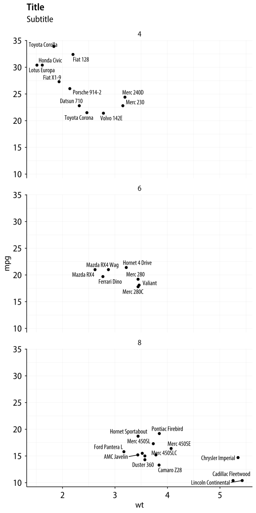

<!-- README.md is generated from README.Rmd. Please edit that file -->

# myriad

## About

Myriad Pro-based theme for ggplot, providing `theme_myriad_semi()`,
`theme_myriad_map()` and `theme_myriad_nymap()`. All based on Myriad Pro
SemiCondensed face, with Myriad Pro Condensed also available for labels
inside the plot area.

Note that this repo does not include the Myriad font files (the `.otf`
files), which are owned by Adobe. You may already have them installed on
your computer, or they may have come bundled with your copy of Acrobat
Reader or other Adobe software.

## Usage

When creating PDFs, use with `showtext`.

``` r
library(tidyverse)
library(ggrepel)
```

``` r
library(showtext)
showtext_opts(dpi = 300)
showtext_auto()

library(myriad)

# Semi variant
import_myriad_semi()

# Condensed for in-graph text
import_myriad_condensed()

# ggplot theme
theme_set(theme_myriad_semi())
```

# Basic Test

``` r
p <- ggplot(mtcars, 
            aes(x = wt, y = mpg)) + 
  geom_point() + 
  labs(x = "Weight", y = "Miles per Gallon", 
       title = "This is the title", subtitle = "This is the subtitle", 
       caption = "This is the caption")  

p
```


# Check PDF works

``` r
ggsave("man/figures/ggfont-test-myrnew-2.pdf", p, width = 6, height = 4)
```

# With labels (using Myriad Pro Condensed)

``` r
out <- mtcars |>
  mutate(car = rownames(mtcars)) |> 
  as_tibble() |> 
  ggplot(aes(x = wt, y = mpg, label = car)) + 
  geom_point() + 
  geom_text_repel(family = "Myriad Pro Condensed") +
  facet_wrap(~ cyl, ncol = 1) + 
  labs(title = "Title", 
       subtitle = "Subtitle")

out
#> Warning: ggrepel: 2 unlabeled data points (too many overlaps). Consider
#> increasing max.overlaps
```



## Check PDF works

``` r
ggsave("man/figures/ggfont-test-myrnew-3.pdf", out, width = 12, height = 8)
```
